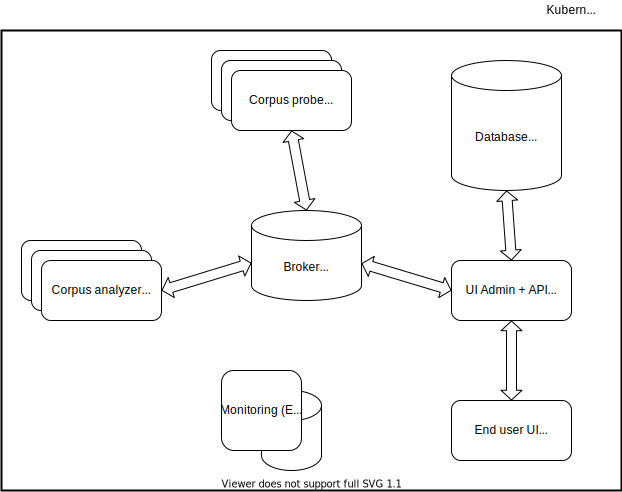

Architecture
============

The software is composed of distributed components implementing services such as:

- Corpus probe: retrieve corpus content (from external sources like Twitter, Wikipedia etc.)
- Corpus analyser: compute corpus metrics (ngrams stats, Word2Vec semantics measures etc.)
- UI Admin + API: user and components management (manage component configuration, corpus storage and their analyzed metrics)
- End user UI: result consultations per user
